# 🎓 College Management System (IIEST Portal)

A full-stack, role-based academic ERP system for student grading, teacher subject allocations, and automated official marksheet generation - designed around real-world university workflows at **IIEST Shibpur**.

## Tech Stack

| Layer | Technology |
|-------|-----------|
| **Frontend** | React 19, React Router 7, Tailwind CSS 4, Vite 7 |
| **Backend** | ASP.NET Core (.NET 10), Entity Framework Core, SQL Server |
| **Auth** | JWT Bearer Authentication, BCrypt password hashing |
| **PDF** | jsPDF + jsPDF-AutoTable (client-side generation) |
| **API Docs** | Swagger / Swashbuckle |

## Features

### 🛡️ Admin Portal

- **Dashboard:** Live stats for students, teachers, and departments.
- **User Registration:** Dynamic form that adapts for Students (Batch, Program, Roll No) or Teachers (Employee ID, Designation).
- **Subject Allocation:** Assign subjects to teachers for specific academic years and semesters.
- **Marksheet Generation Engine:** Cross-references syllabus with submitted grades, blocks generation if marks are missing, and provides 1-click PDF publish that flips the `IsPublished` flag instantly.

### 👨‍🏫 Teacher Portal

- **My Classes:** View all assigned subjects with semester and session info.
- **Smart Grade Entry:** Theory subjects accept Internal (20), Mid-Sem (30), End-Sem (50); Lab subjects auto-detect via subject code and switch to a single Total Mark out of 100.
- **Draft Saving:** Teachers can save partial marks and return later. Only modified rows are updated (dirty checking) with an accurate `ModifiedDate` audit trail.

### 🎓 Student Portal

- **Dashboard:** Current semester and auto-calculated overall CGPA.
- **Secure Grades:** Only published grades are visible. Raw marks are hidden; only Letter Grades and Earned Points are shown with color-coded badges.
- **Profile:** Academic and contact info at a glance.

## Screenshots

### Login

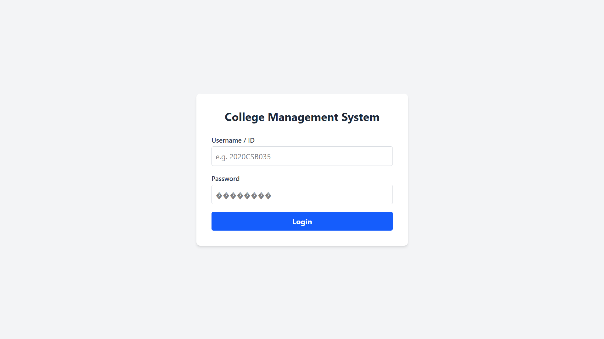

### Admin - Dashboard & Register User

| Register User (Student) | Register User (Teacher) |
|:---:|:---:|
| 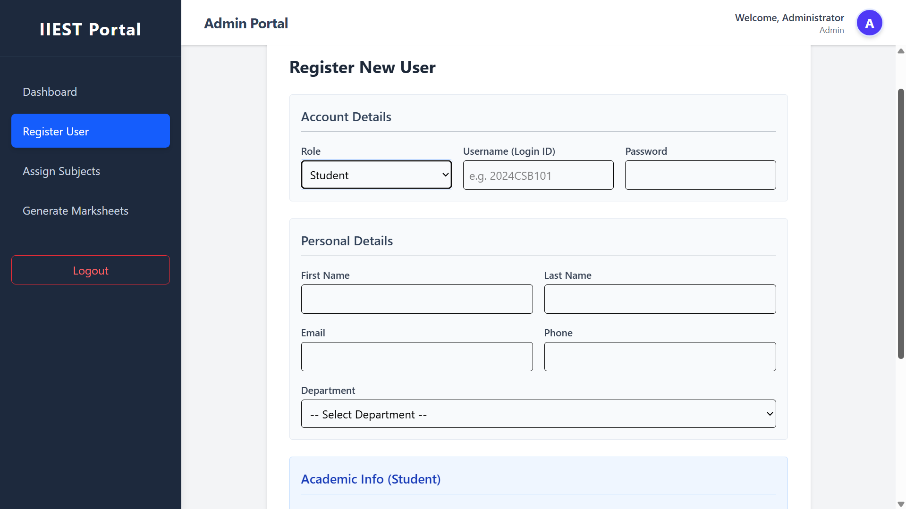 | 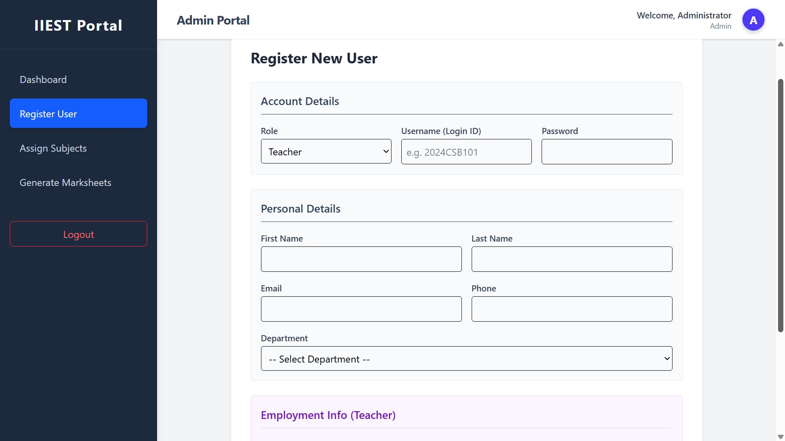 |

### Admin - Assign Subjects & Generate Marksheets

| Assign Subjects | Generate Marksheets |
|:---:|:---:|
| 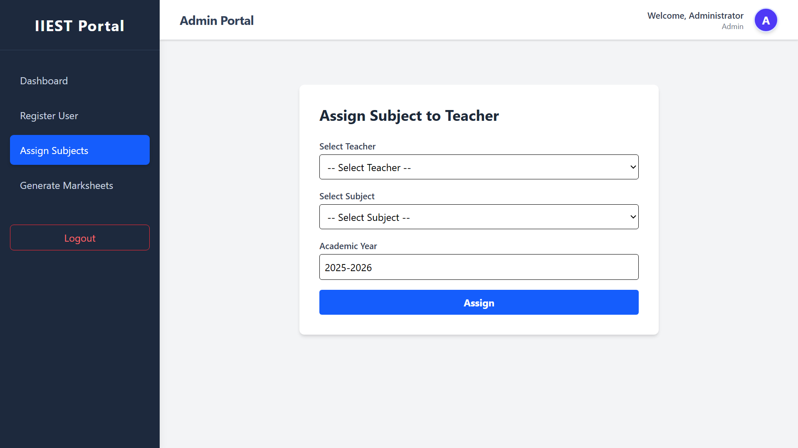 | 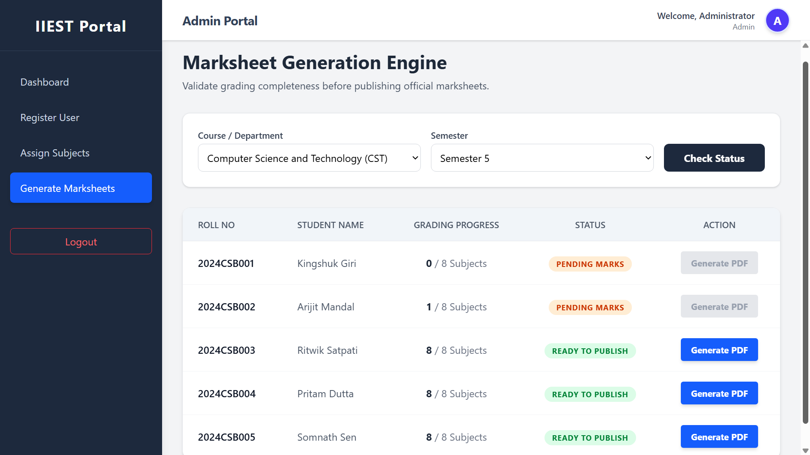 |

### Teacher - Dashboard & My Classes

| Dashboard | My Classes |
|:---:|:---:|
|  | 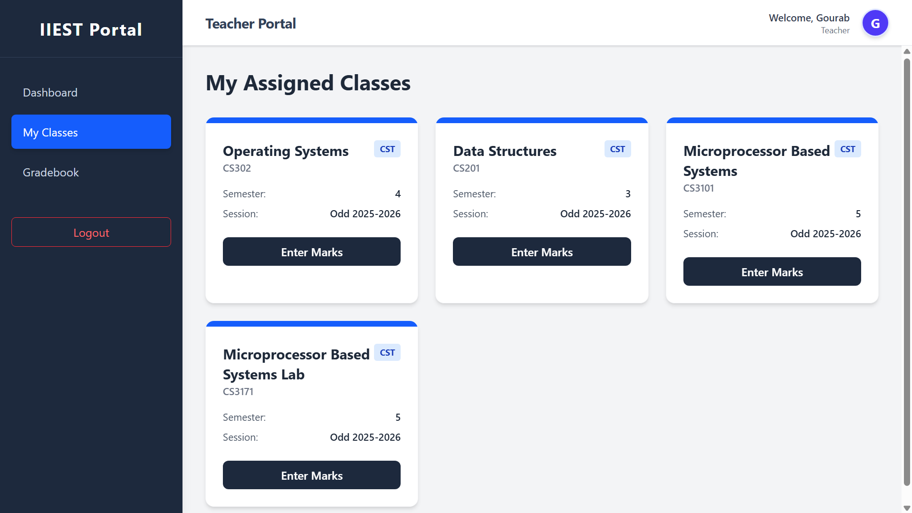 |

### Teacher - Grade Entry

| Theory Subject (Internal + Mid + End) | Lab Subject (Total /100) |
|:---:|:---:|
| 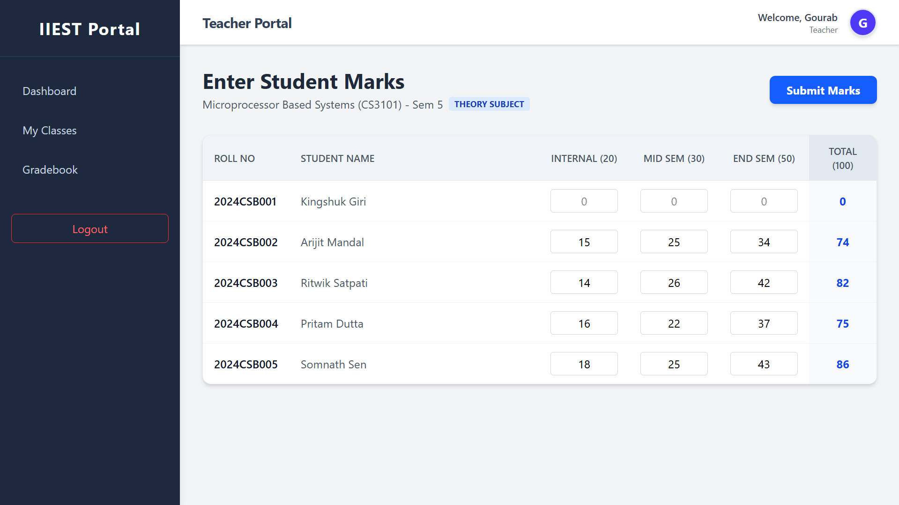 | 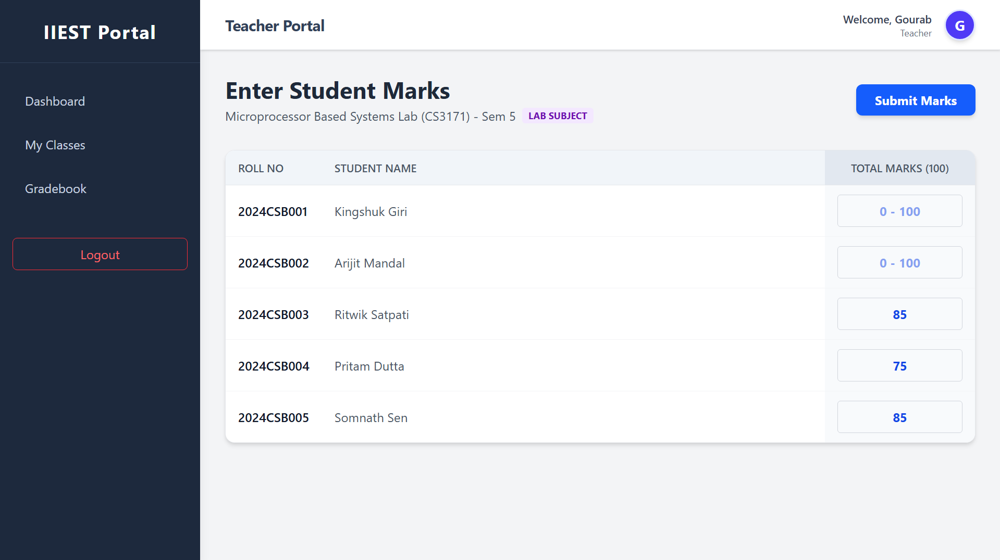 |

### Student - Dashboard, Profile & Grades

| Dashboard | Profile |
|:---:|:---:|
| 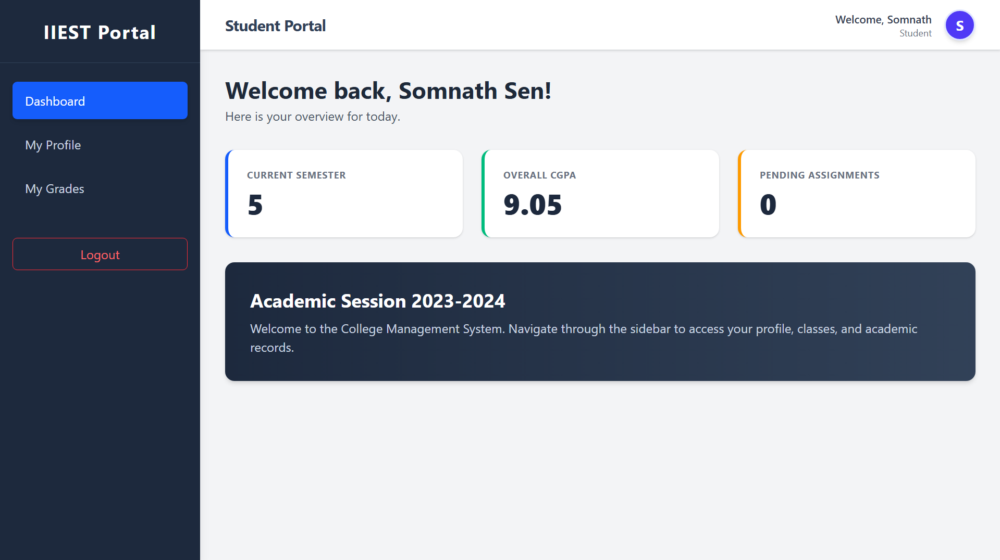 | 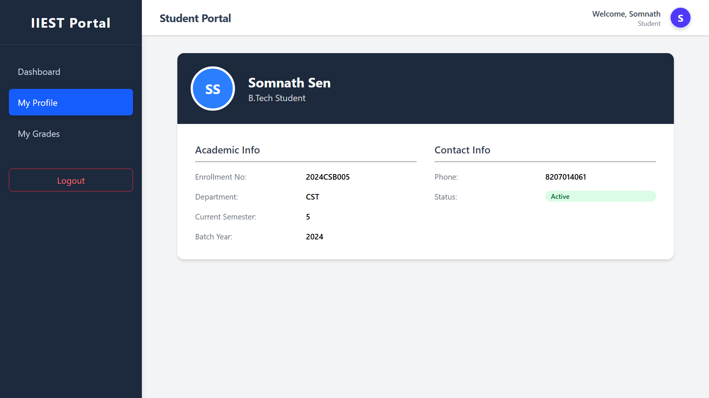 |

| My Grades | Generated Marksheet (PDF) |
|:---:|:---:|
| 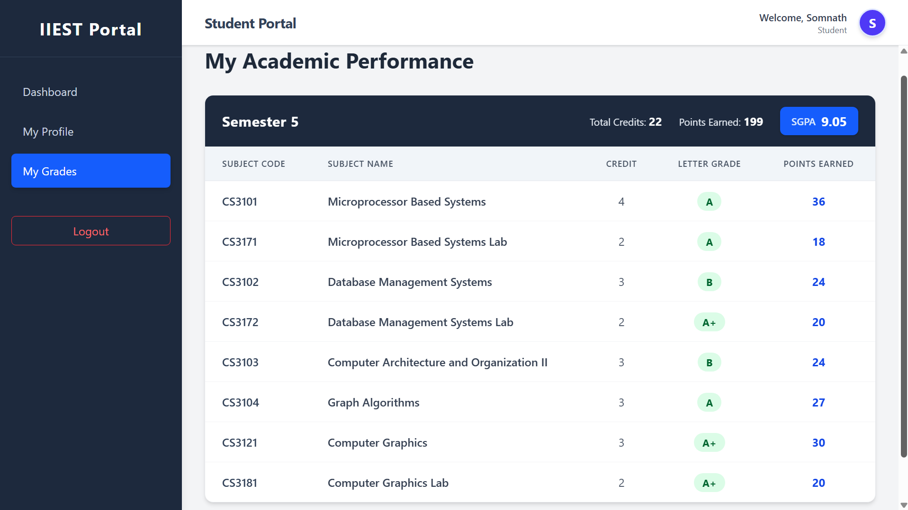 | 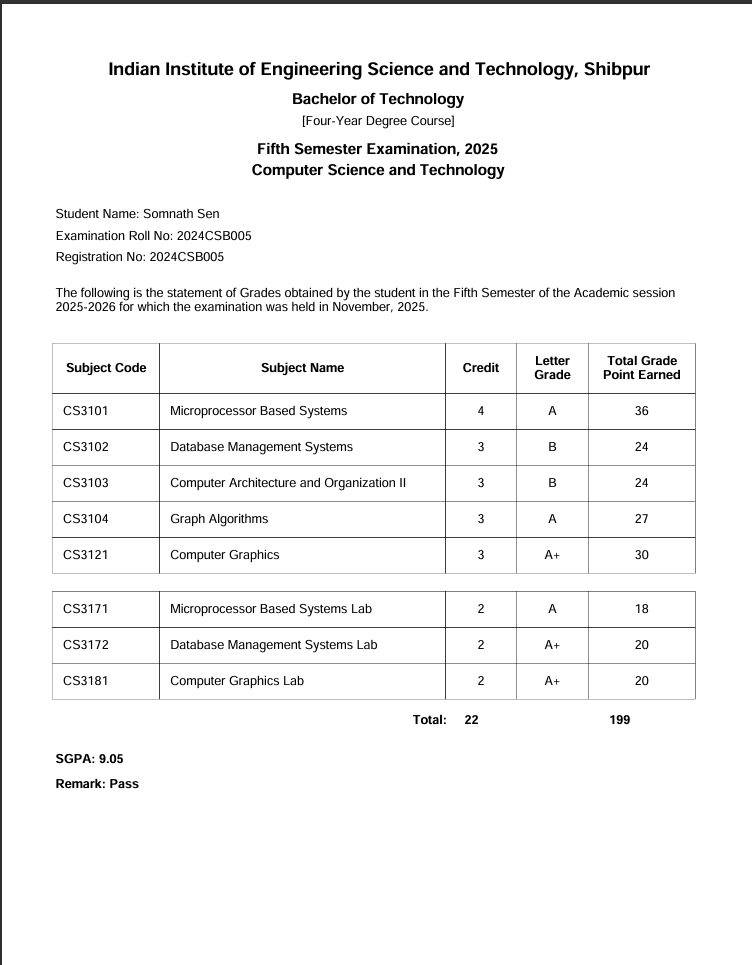 |

## Project Structure

```
CollegeManagementSystem/
├── CollegeManagementAPI/          # ASP.NET Core Web API
│   ├── Controllers/               # Auth, Students, Teachers, Grades, etc.
│   ├── Data/                      # EF Core DbContext
│   ├── Models/                    # Entities & DTOs
│   └── Program.cs
├── CollegeManagementWeb/          # React SPA
│   └── src/
│       ├── components/            # Layout, Sidebar
│       ├── pages/                 # Dashboard, Login, Grades, etc.
│       └── utils/                 # PDF generator
└── screenshots/                   # UI screenshots
```

## Getting Started

### Prerequisites

- .NET 10 SDK
- Node.js 18+
- SQL Server

### Backend

```bash
cd CollegeManagementAPI
dotnet restore
# Update the connection string in appsettings.json
dotnet ef database update
dotnet run
```

### Frontend

```bash
cd CollegeManagementWeb
npm install
npm run dev
```

The API runs on `https://localhost:7xxx` and the frontend on `http://localhost:5173` by default.
